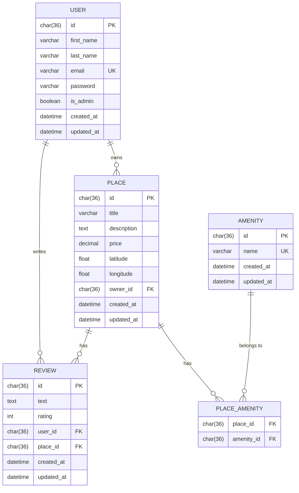

# HBnB — Entity Relationship Diagram

```mermaid
erDiagram
    USER {
        char(36) id PK
        varchar first_name
        varchar last_name
        varchar email UK
        varchar password
        boolean is_admin
        datetime created_at
        datetime updated_at
    }

    PLACE {
        char(36) id PK
        varchar title
        text description
        decimal price
        float latitude
        float longitude
        char(36) owner_id FK
        datetime created_at
        datetime updated_at
    }

    REVIEW {
        char(36) id PK
        text text
        int rating
        char(36) user_id FK
        char(36) place_id FK
        datetime created_at
        datetime updated_at
    }

    AMENITY {
        char(36) id PK
        varchar name UK
        datetime created_at
        datetime updated_at
    }

    PLACE_AMENITY {
        char(36) place_id FK
        char(36) amenity_id FK
    }

    USER ||--o{ PLACE : "owns"
    USER ||--o{ REVIEW : "writes"
    PLACE ||--o{ REVIEW : "has"
    PLACE ||--o{ PLACE_AMENITY : "has"
    AMENITY ||--o{ PLACE_AMENITY : "belongs to"
```